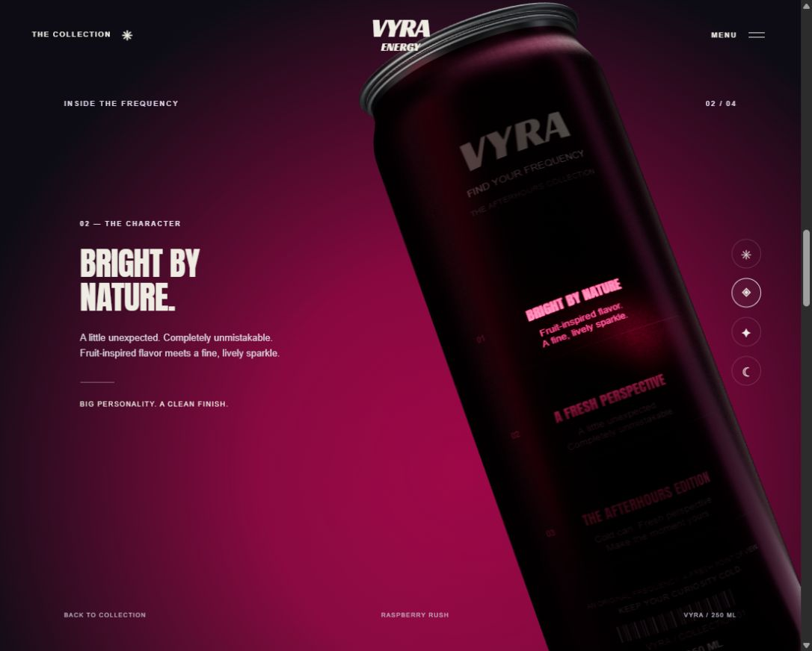
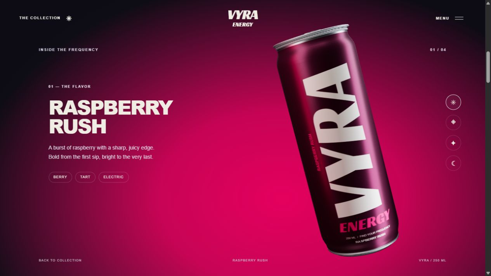

# VYRA Energy

A runnable cinematic product website with an original fictional brand. Its floating can carousel, close-up camera movement and flavor lighting are informed by the supplied reference video. Three.js, fonts and fallback artwork are bundled locally; no installation or build step is needed.

## Run

Run `npm start` in this folder and open `http://127.0.0.1:3000/`. Serve `dist` on any static HTTP host for deployment. Opening the HTML directly uses the artwork fallback because the 3D renderer requires HTTP modules.

## Product experience

- Seven visible carousel positions wrap through five original flavors. Selected-product emphasis, varied depth and rotation, detachable modeled lids and bases, restrained parallax and damped transitions.
- Gradually formed shoulders, fine rolled seams, recessed lid stampings on both sides, an extruded pull tab and rivet, and a domed base with pressure ribs. Printed ink and lacquer use separate roughness and metalness values. Fine draw marks and subtly varied lacquer roughness break up the uniform surface; graduated studio softboxes produce broad aluminum reflections.
- One continuous backdrop carries the homepage into the close-up without a section boundary. Rich flavor color and stronger metallic highlights return outside the dark reading sequence. Supporting cans move offstage rather than shrinking into visible fragments.
- Four product chapters share a single scroll timeline with the renderer. Three reading holds illuminate successive back-label areas with a real projected spotlight. A soft flavor-tinted glow follows only the current text area, fading away as the spotlight moves. The halo is sampled on the curved can surface without a fullscreen bloom pass. The camera gently tracks and enlarges the can during these moments.
- The can turns to its front and pulls back into a complete lineup, which remains visible before the FAQ.
- Desktop scroll experience spans 6.2 viewport heights; mobile spans 5.8. Mobile copy sits below the product, leaving room for its focused label.
- Swipe/drag, arrow buttons, flavor dots, Left/Right/Home/End keys, chapter shortcuts, semantic FAQ, visible keyboard focus, skip link, reduced-motion preference and a persistent motion toggle.

VYRA is a fictional design concept. It has no checkout or manufactured formula.

## Performance

The seven can models share stamping geometry, metal materials and five label sets. Stampings are merged into one draw per independently moving part. A full desktop carousel uses 28 draw calls and about 112,500 triangles; a single close-up uses four draws and about 16,100 triangles. The narrow mobile viewport culls the outer cans.

Label color maps are 1024×2048, with shared 512×1024 surface and focused-print maps. These are painted directly, without scanning image pixels or rebuilding textures while scrolling. The reflection environment uses a 128px cube. Shader programs compile asynchronously before the first rendered frame replaces the fallback artwork.

Rendering uses a capped pixel ratio (1.35 desktop, 1.1 mobile), up to 60 fps during interaction and 30 while settled. Hidden tabs and sections beyond the product experience stop rendering. Scroll measurements are cached when the viewport changes.

Local browser checks during this revision recorded a 2.6-second baseline first 3D frame, a 1.3-second first check after the rebuild, and roughly 0.5–0.8-second subsequent reloads. These are measurements on the development machine, not universal device guarantees.

## Files and checks

- `dist/index.html` — structure and original copy.
- `dist/styles.css` — presentation and responsive composition.
- `dist/app.js` — flavor controls, keyboard/swipe input, menu and FAQ-related state.
- `dist/experience-timeline.js` — shared chapter, spotlight and lineup beats.
- `dist/scene.js` — model geometry, original label textures, physical lighting and camera choreography.
- `dist/vendor` — locally bundled Three.js under its MIT license.
- `dist/assets` — fallback artwork and licensed fonts.
- `server.cjs` — optional local HTTP preview.

Run `npm run check` for source syntax and `npm test` for timeline regressions. The tests verify that chapter links land on their matching label hold, the light pauses on each text area, and the final lineup restores the lighting and remains visible through the exit.

## Credits and reference limits

The brand, copy, label artwork, 3D geometry and lighting setup are original. Fallback product images were generated for this project. Anton and Racing Sans One are bundled under the SIL Open Font License; their license files are in `dist/assets`.

The reference is a 14-second edited recording filmed at an angle. It supports a close visual comparison of the visible desktop sequence, but does not establish exact color values, dimensions, loading performance or the original mobile layout.
